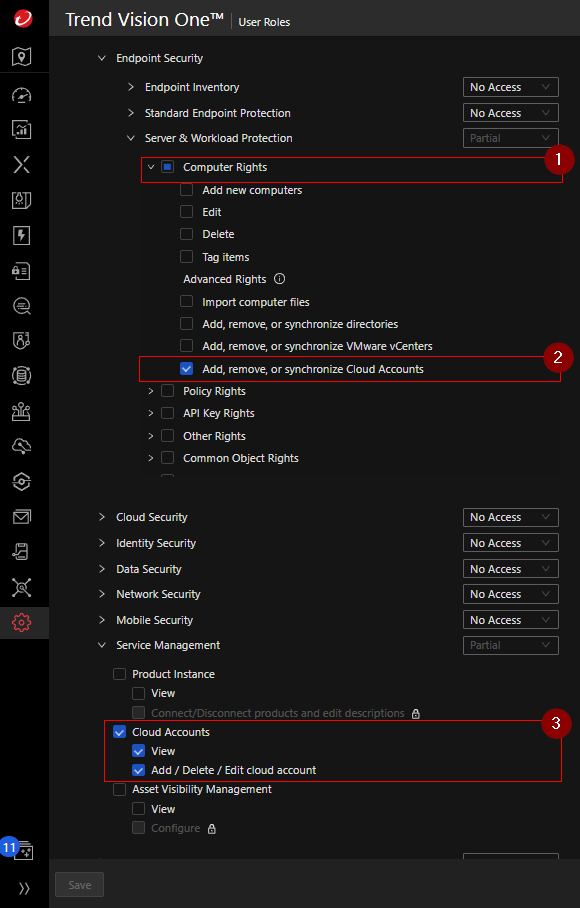
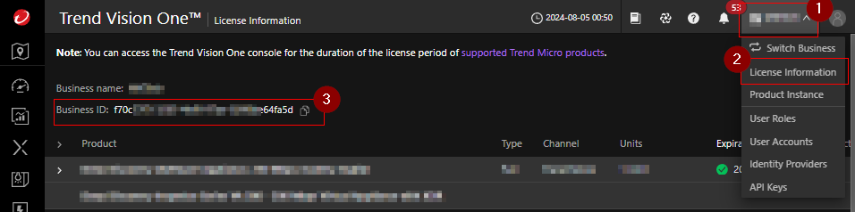

# Vision One Integration Script

This repository contains a Bash script to integrate All Azure subscriptions with Trend Micro Vision One. The script performs several tasks, including creating application registrations, federated credentials, role definitions and role assignments in Azure, and finally registering the subscriptions with Vision One.

## Requirements

- [Azure CLI](https://docs.microsoft.com/en-us/cli/azure/install-azure-cli)
- [jq](https://stedolan.github.io/jq/download/)
- Access and Permission in Azure & Vision One.

## Configuration

1. Create Vision One Custom Role:
    Minimum permissions required for the Vision One integration are:
    [Vision One Role Creation](https://docs.trendmicro.com/en-us/documentation/article/trend-vision-one-configuring-custom-user-roles#GUID-BED80320-70E5-47C4-9530-CC26073D469D-7dm92w)
    []

2. Create ApiKey with Custom Role:
    [Vision One ApiKey Creation](https://docs.trendmicro.com/en-us/documentation/article/trend-vision-one-configuring-api-keys#GUID-3D3A3A3D-3D3A-4D3A-3D3A-3D3A3D3A3D3A-7dm92w)

3. Get Vision One Account ID:
    []

4. Download the script repository:
    ```sh
    wget https://github.com/<user_name>/v1-cloud-community/main/CAM/Azure/Onboarding/azure-bash-all-subscription-integration/AzureOnboarding.sh
    ```
5. Azure CLI Login:
    ```sh
    az login
    ```

6. Configure the Environment Variables:
    ```sh
    export API_KEY="<your_v1_api_key>"
    export V1_ACCOUNT_ID="<your_v1_account_id>"
    export WORKLOAD_INSTANCE_ID="<your_workload_instance_id>"  # is Optional of you don't have it
    ```
7. Give execute permission to the script:
    ```sh
    chmod +x AzureOnboarding.sh
    ```
8. Run the script:
    ```sh
    ./AzureOnboarding.sh
    ```
9. wait for the script to complete the execution.

## Created By XeniaP - Trend Micro