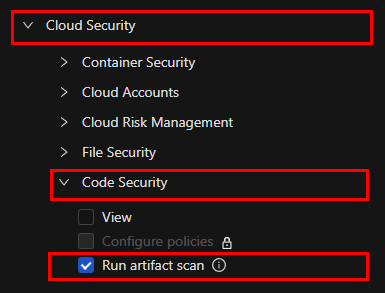
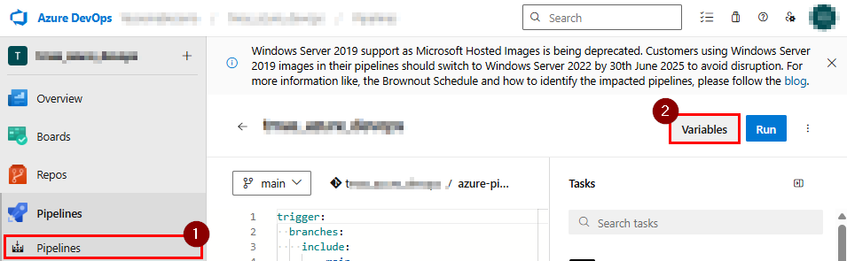
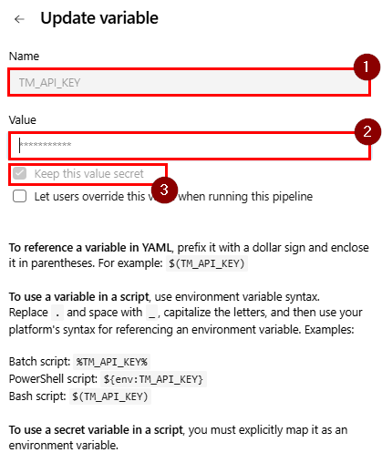

# Vision One Infrastructure as Code Scan Integration with Azure DevOps Pipelines

This guide explains how to integrate the Trend Micro Artifact Scanner (TMAS) Scan into Azure DevOps Pipelines.

> For more information about the Vision One platform, you can check the official documentation [here](https://docs.trendmicro.com/en-us/documentation/article/trend-vision-one-artifact-scanner-tmas).

---

## 1. Create an API Key in Vision One

- Refer to the [API Key Creation Guide](https://docs.trendmicro.com/en-us/documentation/article/trend-vision-one-platform-api-keys).
- For best practices, it is recommended to create a custom role with the following minimum permissions:



---

## 2. Configure the API Key in Azure DevOps

- In your Azure DevOps Pipeline, create an environment variable named `TM_API_KEY` and assign it the value of the API Key created in the previous step.
- Make sure to mark the variable as secret.




---

## 3. Add the following code snippet to your pipeline

```yaml
# Example pipeline snippet
    - script: |
        tar --version
        wget https://cli.artifactscan.cloudone.trendmicro.com/tmas-cli/latest/tmas-cli_Linux_x86_64.tar.gz
      displayName: Get Latest Version of TMAS
    - task: ExtractFiles@1
      inputs:
        archiveFilePatterns: '**/tmas-cli_Linux_x86_64.tar.gz'
        destinationFolder: 'tmas-cli'
        cleanDestinationFolder: true
        overwriteExistingFiles: true
    - task: Bash@3
      displayName: Save Docker Image
      inputs:
        targetType: 'inline'
        script: |
          docker save $(repository):$(tag) -o image.tar
    - task: Bash@3
      displayName: "Scan from Registry to Json"
      inputs:
        targetType: 'inline'
        script: ./tmas-cli/tmas scan docker-archive:image.tar -VMS --saveSBOM > result.json
      env:
        TMAS_API_KEY: $(TMAS_API_KEY)
```

## 4. Save and run your pipeline
## 5. The scan results can be reviewed in directly in Vision One
## 6. [Optional] if you want create a Report in Excel format, you can use the following code snippet:

```yaml
    - script: |
        git clone https://github.com/XeniaP/CS-ArtifactScanner-Report.git
        pip install -r ./CS-ArtifactScanner-Report/requirements.txt
        python ./CS-ArtifactScanner-Report/export_report_tmas.py $(imageName) --resultFile ./result.json
        FILE=$(ls *.xlsx | head -n 1)
        echo "##vso[task.setvariable variable=excelFileName]$FILE"
      displayName: Create Excel Report with Vulnerabilities
    - task: PublishPipelineArtifact@1
      inputs:
        targetPath: '$(System.DefaultWorkingDirectory)/$(excelFileName)'
        publishLocation: 'pipeline'
```

## 🤝 Contributing

Contributions are welcome!  
If you encounter any issues, bugs, or have suggestions for improvements, please feel free to [open an issue](https://github.com/xeniap/TM_CodeSecurity_CI_Integration/issues).  

We appreciate your feedback and collaboration to make this integration better for everyone.
